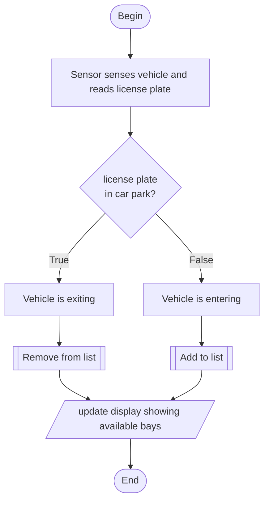
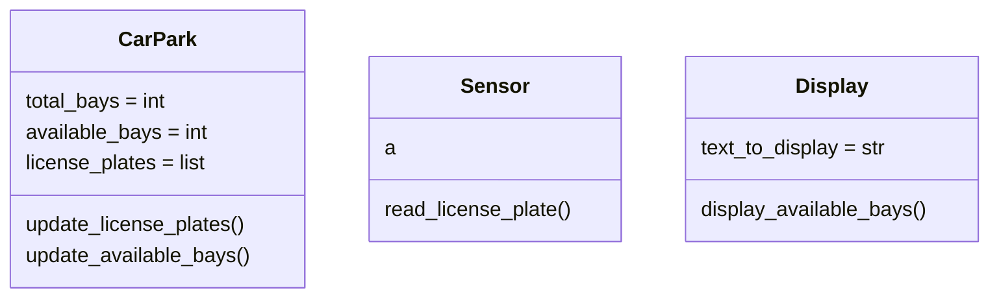

# Moondalup Car Park Project

##### This project will meet the requirements set out in the Assessment Document.

### Overview

>The City of Moondalup is progressively embracing smart city initiatives 
to enhance urban living, improve efficiency in city services, and promote 
sustainable practices. As part of this initiative, the city council is eager 
to transition to a smart parking solution to optimize car park usage, reduce 
traffic congestion, and enhance the overall parking experience for residents 
and visitors.
>
>The City of Moondalup is progressively embracing smart city initiatives to enhance 
urban living, improve efficiency in city services, and promote sustainable practices. 
As part of this initiative, the city council is eager to transition to a smart parking 
solution to optimise car park usage, reduce traffic congestion, and enhance the overall 
parking experience for residents and visitors.
>
>You have been contracted to create a prototype solution that uses sensors and displays 
to provide timely information about available parking bays as well as relevant information
about weather and other community messages.

### Application requirements

>- [ ] The system must accurately track the status of each parking bay in real-time.
>- [ ] The display must be updated promptly as cars enter or exit.
>- [ ] The system should be robust, easy to maintain, and scalable for future enhancements.
>- [ ] The application must follow best coding practices and include unit testing.
>- [x] You must use Git and Github for version management. 

### Coding requirements

>- [ ] Create at least three classes.
>- [ ] At least one class must include three or more parameters.
>- [ ] At least one class must aggregate another class.
>- [ ] You should demonstrate an example of polymorphism
>- [ ] Include at least two unit cases
>- [ ] Create a main.py demonstrating the core interaction between instances of your 
classes
>- [ ] Use PEP8 throughout your code and docstrings for major functions within your code

### Version control requirements

>- [x] Create a new repository and configure it with a README, .gitignore, and other 
essential setup files.
>- [x] Initialize your local repository and link it to a remote repository on GitHub.
>- [ ] Make initial commits with the basic structure of your car park system.
>- [ ] As you develop the system, commit your changes each time you reach a significant
milestone or complete a task.
>- [ ] Make at least three commits to demonstrate the evolution of your project.
>- [ ] Manage any changes or improvements by committing to the repository with clear, 
descriptive commit messages.

### Diagrams

#### Process flow

#### Classes

